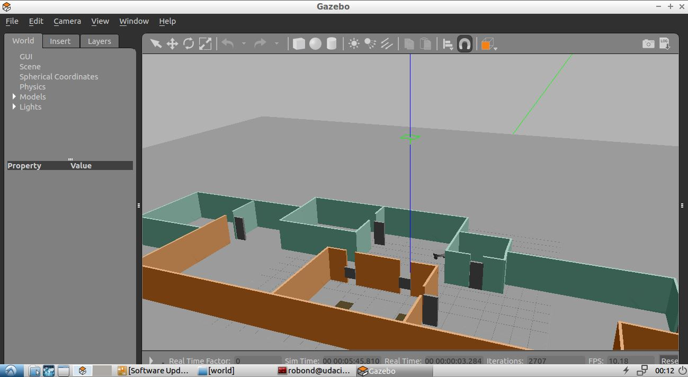
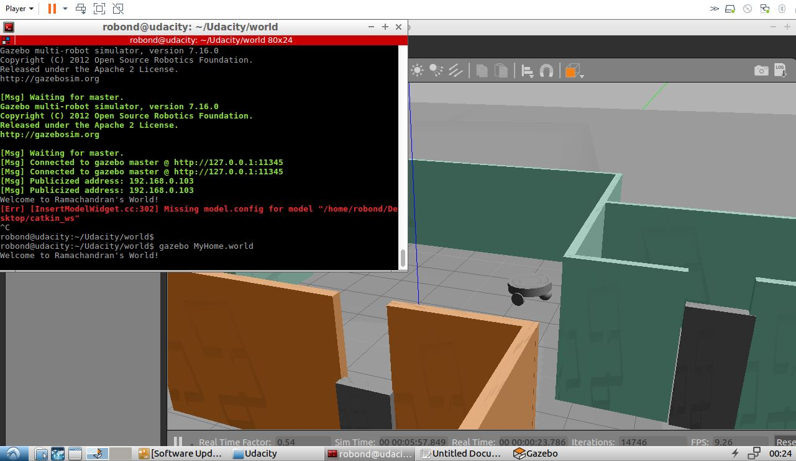

# Helloworld-Gazebo
Robotics Software Engineering

<p>
 The Project uses a signle level environment resembling a room with doors, windows and other obstacles. The environment can be used in future for Robot localization and mapping.
 ROS Gazebo the physics engine behind the project is used to print Welcome to my world in the terminal while executing the world file. The project also contains a simple two wheeled robot.
 </p>
 
 <h2> Installation Instruction </h2>
 
 ```
 mkdir build
 cd build
 cmake ../
 make
 cd ../world
 export GAZEBO_PLUGIN_PATH=${GAZEBO_PLUGIN_PATH}:/home/robond/Udacity/build
 gazebo MyHome.world 
 //for detailed exexution logs use gazebo MyHome.world --verbose
 ```
 
 <h2> Output </h2>
 
 <h3> The World with the model </h3>
 
 <h3> Welcome to my world in terminal </h3>
 
 
 
 
 
